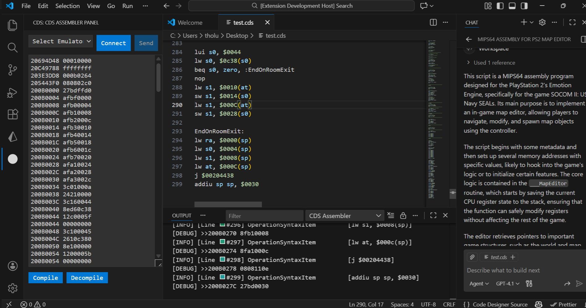
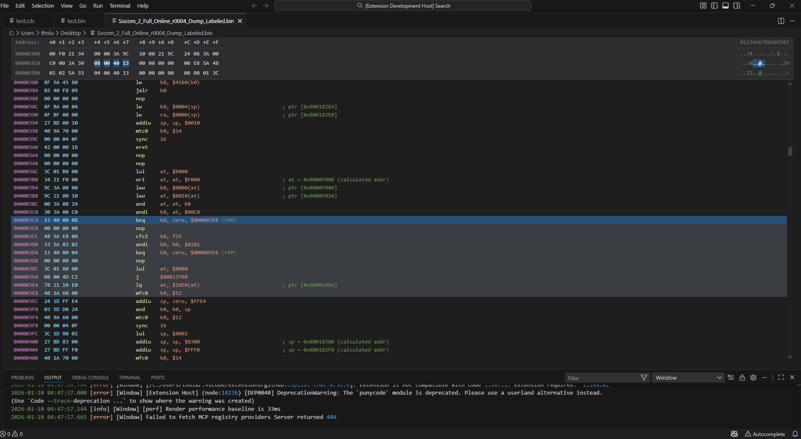
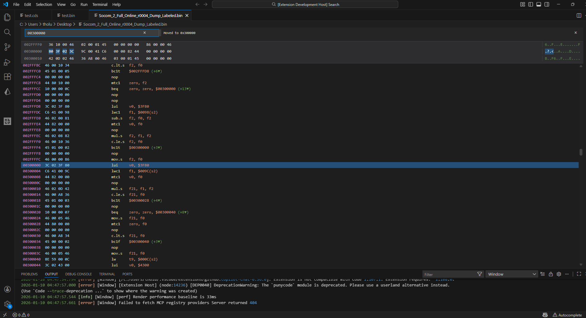
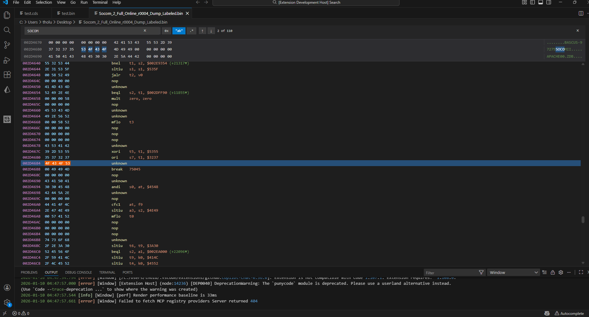

# CodeDesignerAI VSCode [](https://github.com/TylerDev888/CodeDesignerAI/actions/workflows/ci.yml)
CDS Assembler


Disasm




## Description
A MIPS64 (PS2 Emotion Engine) assembler / disassembler with extended pseudo-commands and directives for custom CDS scripts. Used to create custom patches for the playstation 2. Make sure to use github co-pilot with this vs code extension. 

## Example CDS script
```asm
/*
This is a test cds script
*/
address $20694d48 
hexcode $00010000

address $20c49788
hexcode $ffffffff

address $200c0000
print "this is a string"
nop
___OnRoomExit:
addiu sp, sp, $FFd0
sw ra, $0000(sp)
sw s0, $0004(sp)
sw s1, $0008(sp)
sw at, $000C(sp)

setreg at, $002CED04
setreg s1, $03e00008
sw s1, $0000(at)

setreg at, $000A0000
sw zero, $0000(at)
sw zero, $0004(at)
sw zero, $0008(at)

// load pointer
lui s0, $0044
lw s0, $0c38(s0)
beq s0, zero, :EndOnRoomExit
nop
lw s1, $0010(at)
sw s1, $0014(s0)
lw s1, $000C(at)
sw s1, $0028(s0)

EndOnRoomExit:
lw ra, $0000(sp)
lw s0, $0004(sp)
lw s1, $0008(sp)
lw at, $000C(sp)
j $00204438
addiu sp sp, $0030
```

## Planned Enhancements / Future Work

- **VS Code Disassembler Views**
  - Add disassembler-style windows that mirror *PCSX2Dis*, including address, opcode bytes, labels, operations, and annotations.

- **PCSX2 Integration**
  - Native integration with PCSX2 for live memory inspection, breakpoint-style workflows, and runtime code injection.

- **Cheat Engine Integration**
  - Optional interoperability with Cheat Engine for scanning, validation, and memory manipulation workflows.

- **Expanded Pseudo Syntax**
  - Introduce richer, higher-level pseudo-instructions to simplify common patterns and improve readability.

- **AI / Code Generation Integration**
  - Deeper integration with GitHub Copilot and/or a custom LLM for:
    - Code generation
    - Pattern recognition
    - Automatic code discovery and suggestion

- **Multi-Platform Emulator Support**
  - Extend support beyond PCSX2 to additional consoles and emulators as the architecture matures.

## Projects and READMEs
- CLI & tooling
  - [CodeDesigner.ConsoleApp](CodeDesigner.ConsoleApp/ReadMe.md) — Console front-end / CLI
  - [CodeDesigner.Languages](CodeDesigner.Languages/README.md) — Parsers, models, `CDSFile`
  - [CodeDesigner.Library](CodeDesigner.Library/README.md) — Shared utilities and domain models
  - [CodeDesigner.OpenAI](CodeDesigner.OpenAI/README.md) — OpenAI integration helpers
- Web & editor
  - [website/cd-client](website/cd-client/README.md) — Angular UI client
  - [vscode/cds-assembler](vscode/cds-assembler/README.md) — VS Code extension for assembler tooling
  - [vscode/cds-language](vscode/cds-language/README.md) — VS Code language support for `.cds` files

If a link points to a missing README, open the target folder and create the `README.md` file there.

## Legend (quick reference)
- [D] Development setup — how to run locally (install, start, test)  
- [B] Build / Packaging — produce distributables or publish artifacts  
- [I] Integration — how projects connect (APIs, CLI, extension tasks)  
- [C] Contributing — guidelines for fixes and features

Each project README contains sections marked with the letters above when applicable.

## Recommended workflow
1. Open the project README for the area you will work on (links above).  
2. For UI work: run the web client in `website/cd-client` (`npm install` then `npm run start`).  
3. For editor extensions: open the `vscode/` folder in VS Code and use F5 to test.  
4. For CLI behavior: run `dotnet run --project CodeDesigner.ConsoleApp -- <verb> [options]`.

## Contacts & contribution
- Keep README updates in sync with code changes.  
- Add changelogs or release notes where appropriate.  
- Prefer small, focused PRs and include test or verification steps in the PR description.

## Branching Strategy
  - Define and document a clear Git branching model (e.g., `main`, `dev`, `feature`, `bug`)
  - Establish pull request requirements, review expectations, and CI validation rules

